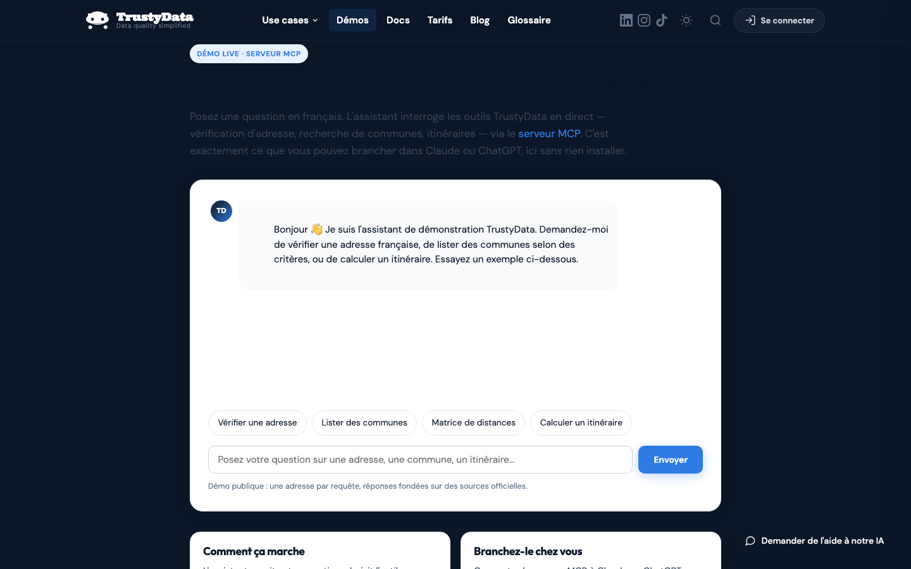

# TrustyData MCP Server

[](./LICENSE)
[](https://mcp.trustydata.app/mcp)
[](https://status.trustydata.app)

Connect your LLM (Claude, ChatGPT, IDE assistants…) to **[TrustyData](https://trustydata.fr)** —
French **address data quality**, geocoding, routing, **company lookup** (SIRENE)
and **catchment-area statistics** (INSEE), built on official open data sources
(**BAN**, **INSEE**, **SIRENE**, **IGN**, **OpenStreetMap**).

**▶️ [Try it live — public demo agent, no account needed](https://trustydata.fr/demo/mcp-agent)**
Ask a real agent to verify an address, list communes, look up a company or
compute a route: it calls this MCP server in front of you.

[](https://trustydata.fr/demo/mcp-agent)

This is a **hosted, remote MCP server** — there is nothing to install or run.
Point your MCP client at the endpoint below and sign in with your TrustyData
account.

| | |
|---|---|
| **Endpoint** | `https://mcp.trustydata.app/mcp` |
| **Transport** | Streamable HTTP |
| **Auth** | OAuth 2.1 (sign in with your TrustyData account) |
| **Docs** | https://trustydata.fr/docs/ |
| **Status** | https://status.trustydata.app |

> This repository hosts the **public listing metadata** for the TrustyData MCP
> server (`server.json`, documentation, examples). The server itself is a hosted
> service — the source of the underlying data API is not part of this repo.

## What it does

TrustyData turns messy French addresses into clean, authoritative data and adds
geographic context, directly inside your LLM conversation:

- **Verify & normalize** a French postal address against the official **BAN**
  reference (the result is authoritative — an empty result means no match).
- **Search** addresses and localities by name, postal code or INSEE code, with
  optional filters (department, region, population).
- **Proximity search** — find addresses or points near a location.
- **Routing** — compute a road route or a travel-time/distance matrix in France
  (OpenStreetMap), by car, on foot or by bike.
- **Company lookup** — search French companies and establishments in the
  official **SIRENE** registry and get full records (executives, finances,
  collective agreements, depending on your plan).
- **Catchment areas** — population, households, income, age and
  socio-professional profile, spending potential of a drive-time or radius zone
  (**INSEE** Filosofi & census); compare up to 10 zones and measure what each
  one covers exclusively.

Richer fields (e.g. INSEE Filosofi statistical grid, Lambert 93 coordinates) are
returned depending on your plan.

## Tools

| Tool | What it does | Minimum plan |
|---|---|---|
| `verify_address` | Verify & normalize a French address against the BAN | Discovery |
| `search_address` | Autocomplete / search full addresses | Discovery |
| `get_address_details` | Full detail for a given address id | Discovery |
| `search_locality` | Search French communes / localities | Discovery |
| `search_nearby` | Proximity search around a point | Growth |
| `route_matrix` | Travel-time / distance matrix (car, foot, bike) | Growth |
| `compute_route` | Full road route between points (car, foot, bike) | Business |
| `search_company` | Search French companies & establishments in the SIRENE registry (name, SIREN/SIRET, activity, location) | Discovery (proximity search: Growth) |
| `get_company_details` | Full record of an establishment or company (identity, executives, finances, collective agreements — by plan) | Discovery |
| `zone_stats` | Population, households, income, age & socio-professional profile, spending potential and DVF real-estate sale prices (5-year trend, vs. département) of a catchment area (drive time or radius) | Growth |
| `zone_compare` | Compare 2–10 catchment areas: exclusive population, pairwise overlaps, ranking — each with its full `zone_stats` block, real-estate prices included | Growth |

All tools are advertised to every client. If your plan doesn't cover a tool, it
returns an actionable upgrade message instead of failing silently.

## Prompts

Beyond tools, the server ships five **prompts** — guided starters that fill in
the right parameters for you. In Claude Code they show up as
`/mcp__trustydata__<name>`; other MCP clients surface them their own way.

| Prompt | Arguments | What it does |
|---|---|---|
| `zone_de_chalandise` | `adresse`, `minutes` (10), `mode` (car) | Full INSEE profile of a catchment area, with real-estate sale prices |
| `comparer_emplacements` | `adresses` (2–10), `minutes` (10) | Compare locations, ranked on exclusive population |
| `potentiel_commerce` | `adresse`, `secteur`, `minutes` (10), `coefficient` | Estimated disposable income and sector spending potential |
| `verifier_adresses` | `adresses` | Verify a list of addresses, one call each |
| `qualifier_entreprise` | `nom_ou_siret` | Find a company in SIRENE and open its full record |

Prompt names and wording are French, like the data they describe. A prompt
returns a message, not a result: it calls no tool by itself and consumes no
quota — the tool it points at applies its own plan requirement when the
assistant calls it.

## Connect

### Claude (claude.ai / Claude Desktop)

Add a **custom connector** pointing to:

```
https://mcp.trustydata.app/mcp
```

You'll be prompted to sign in via OAuth with your TrustyData account the first
time a tool is used.

### Generic MCP client (Streamable HTTP)

```json
{
  "mcpServers": {
    "trustydata": {
      "url": "https://mcp.trustydata.app/mcp"
    }
  }
}
```

Don't have an account yet? Start free on
**[trustydata.fr](https://trustydata.fr)** — the Discovery plan is free
(5,000 requests/month, no card required).

## Example prompts (free-form)

No prompt needed — just ask:

```
Vérifie et normalise cette adresse : "1 rue de Rivol 75001 Pari"

Quelle est la population de la commune de Bourg-en-Bresse ?

Trouve les adresses proches du 2 avenue de la Gare à Annecy.

Calcule l'itinéraire routier entre Lyon Part-Dieu et l'aéroport Saint-Exupéry.

Trouve les entreprises de plomberie à Annecy et donne-moi la fiche du premier établissement.

Combien de personnes habitent à 15 minutes en voiture du 1 rue Scribe, 75009 Paris, et quel est leur niveau de vie ?

Compare 10 minutes en voiture autour de la Part-Dieu et autour de Bellecour : quelle zone capte le plus d'habitants qu'elle est seule à couvrir ?
```

## Data sources & attribution

TrustyData relies on official, regularly-updated open data. Please keep the
attributions returned by the tools:

- **Addresses & communes** — Base Adresse Nationale (BAN) & INSEE
- **Companies** — SIRENE (INSEE), Registre National des Entreprises (INPI)
- **Statistical context & catchment areas** — INSEE Filosofi and census, IGN Contours IRIS
- **Routing** — OpenStreetMap contributors (ODbL)

## Documentation

Full API guides, endpoint reference and examples:
**https://trustydata.fr/docs/**

## License

The contents of this listing repository (documentation, `server.json`, examples)
are released under the [MIT License](./LICENSE). The hosted service and the
underlying data API are operated by TrustyData and governed by its terms.
